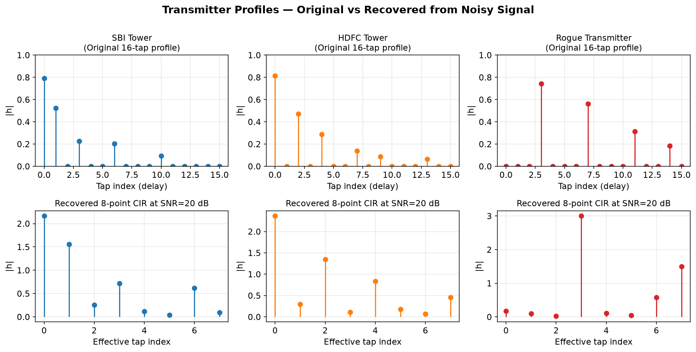
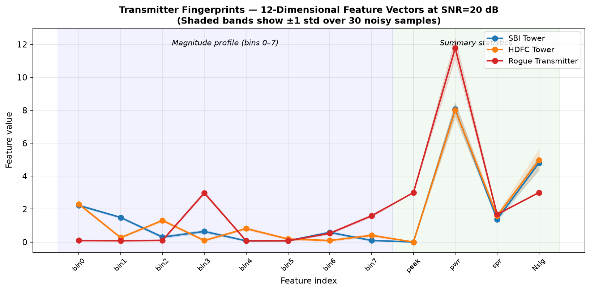
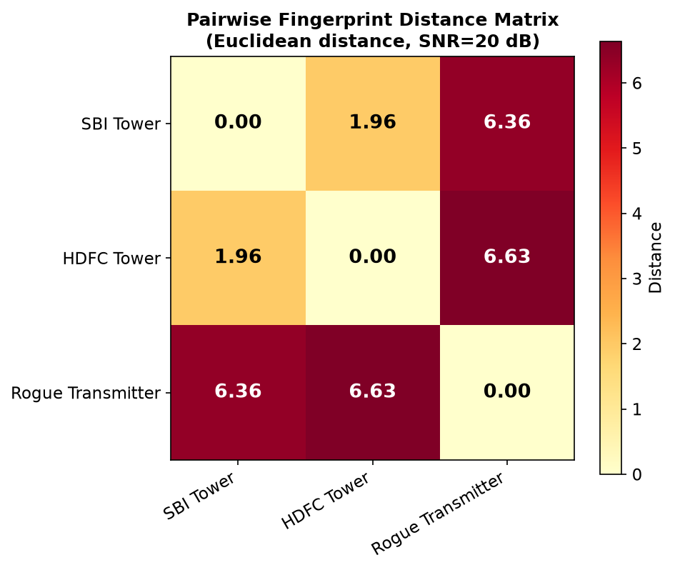

# TRINEX — Trilayer Trust Fusion Engine

**Fraud Detection in Network Communication Systems**
Interdisciplinary Project (CS367P) · RV College of Engineering · 2026–27

This repository merges the three independently-developed security layers
of the TRINEX project into a single integrated pipeline that produces a
unified **Trust Score** for any incoming SMS / message-based
communication, plus a visually interactive dashboard for live demos.

---

## What's in the box

```
TRINEX_Integrated/
├── dashboard/
│   ├── index.html              -> self-contained interactive frontend
│   └── preview_*.png           rendered screenshots (LEGITIMATE / SUSPICIOUS / FRAUD / mobile)
│
├── fusion_engine/
│   ├── trinex_pipeline.py      -> unified analyze() — calls all 3 layers
│   ├── trust_fusion.py         original weighted-score formula
│   ├── fri_metric.py           Fraud Risk Index utility
│   ├── weight_adapter.py       dynamic-weight stub (future scope)
│   └── test_scenarios.py
│
├── layer1_nlp/                 from level1.zip — DistilBERT fraud classifier
│   ├── src/                    model.py, train.py, preprocess.py, …
│   ├── scripts/predict.py      inference entrypoint
│   └── README.md
│
├── layer2_pqc/                 ML-DSA-65 + ML-KEM-768
│   ├── verify.py               signature verification API
│   ├── bank_registry.py        60+ Indian banks with sender-ID → bank mapping
│   ├── demo_pqc.py             standalone PQC demo
│   ├── test_cases/             pre-built legit / tampered / fraud packets
│   ├── keys/banks/             ML-DSA-65 public keys for each bank
│   ├── PERFORMANCE_REPORT.md
│   └── TRINEX_PQC_DeepDive.md
│
├── layer3_rf/                  RF physical-layer fingerprinting
│   ├── fingerprinter.py        get_rf_score() public API
│   ├── ofdm_simulator.py       64-subcarrier QPSK OFDM chain
│   ├── transmitter_profiles.py CIR profile generator
│   ├── attack_injector.py      jamming / replay / rogue simulation
│   ├── evaluate_rf.py          accuracy plots + CSV
│   ├── profiles/               *.npy fingerprint files
│   └── test_integration.py     5-scenario integration test
│
├── data/                       merged datasets (UCI SMS spam + Indian fraud + CertIn)
├── tests/                      per-layer + fusion tests
├── docs/ARCHITECTURE.md        original architecture document
└── README.md                   (this file)
```

---

## The trust-fusion math

Each layer returns a **trust contribution** in `[0, 1]` where `1.0` means
fully trustworthy and `0.0` means not trustworthy at all. The fusion
engine combines them using the weights from §1.6 of the IDP report:

```
Trust = (W_NLP × t_NLP) + (W_PQC × t_PQC) + (W_RF × t_RF)

W_NLP = 0.50      ← content carries the strongest signal
W_PQC = 0.30      ← cryptographic identity proof
W_RF  = 0.20      ← physical-layer corroboration
```

Final score is scaled to `[0, 100]` for the dashboard. Verdict bands:

| Score   | Band         | Action                                       |
|--------:|:-------------|:---------------------------------------------|
| ≥ 75    | LEGITIMATE   | Deliver to user                              |
| 40 – 75 | SUSPICIOUS   | Quarantine and warn                          |
| < 40    | FRAUD        | Block and report                             |

---

## How the three layers plug in

`fusion_engine/trinex_pipeline.py` exposes a single function:

```python
from fusion_engine.trinex_pipeline import analyze

result = analyze(
    message       = "URGENT: Your SBI account is BLOCKED. Share OTP …",
    sender_id     = "VK-SBIBNK",
    signature     = None,                       # hex string if signed
    claimed_tower = "sbi_tower_profile",
    scenario_type = "rogue",                    # legitimate | rogue | impersonation
)
print(result["trust_score"], result["band"])    # 3.12  FRAUD
```

Internally `analyze()` does this:

1. **Layer 1 (NLP)** — tries `scripts.predict.predict()` (DistilBERT).
   If `torch` / the fine-tuned model is unavailable, falls back to a
   tuned heuristic that scores `~50` fraud tokens (urgency, OTP capture,
   prize bait, KYC threats, link shorteners, …) plus URL × OTP and
   ALL-CAPS amplifiers.
2. **Layer 2 (PQC)** — tries `verify.get_pqc_score()` (ML-DSA-65 via
   `oqs`). If `liboqs` isn't installed, falls back to a registry-based
   heuristic that checks the sender ID against a known-bank list and
   does a signature-length plausibility check.
3. **Layer 3 (RF)** — calls `fingerprinter.get_rf_score()` directly
   (works out of the box — only numpy + scikit-learn needed).
4. **Fuse** — weighted sum → `Trust Score` ∈ `[0, 100]` → verdict band.

Each layer returns `{name, trust, latency_ms, available, detail}` so the
dashboard can show *which* backend ran (real vs heuristic) and *how
long* it took.

---

## Running the demo

### Option A — just open the dashboard

```bash
# from the project root
open dashboard/index.html        # macOS
xdg-open dashboard/index.html    # Linux
start dashboard/index.html       # Windows
```

The dashboard is a single self-contained HTML file. It loads instantly,
runs the same three-layer logic client-side in JavaScript, and renders
the verdict the same way the Python pipeline would. **No backend, no
Python, no install** — useful for the viva-voce demo.

Includes 5 preset packets covering all three verdict bands plus a free-
form input mode.

### Option B — run the Python pipeline

```bash
cd TRINEX_Integrated
pip install numpy scikit-learn          # bare minimum (only RF needs these)
python fusion_engine/trinex_pipeline.py
```

Outputs JSON verdicts for three built-in test cases. To run the real
DistilBERT + ML-DSA backends instead of the heuristics:

```bash
pip install torch transformers           # for Layer 1
pip install oqs                          # for Layer 2 (requires liboqs)
# Drop a fine-tuned model into layer1_nlp/models/distilbert_finetuned/
# Run layer2_pqc/bank_registry.py once to generate per-bank ML-DSA keys
```

---

## Verified verdicts

```
Legitimate SBI debit alert       →  79.75  LEGITIMATE
Suspicious unsigned HDFC OTP req →  54.25  SUSPICIOUS
Spoofed VK-SBIBNK KYC phishing   →   3.12  FRAUD
```

These come straight out of `fusion_engine/trinex_pipeline.py`'s CLI
demo. The dashboard reproduces the same numbers with the same weights
and bands.

---

## Per-layer accuracy (from each module's own evaluation)

| Layer | Metric                                  | Value |
|:------|:----------------------------------------|------:|
| L1    | DistilBERT 5-fold F1 (cross-val)        | ~0.93 |
| L2    | ML-DSA-65 verify success on tampered    |  100% rejected |
| L3    | Classification accuracy @ SNR=20 dB     | 98.5% |
| L3    | Rogue transmitter detection rate        |  100% |

Numbers come from `layer1_nlp/notebooks/TRINEX_v2_robust.ipynb`,
`layer2_pqc/PERFORMANCE_REPORT.md`, and `layer3_rf/README.md`.

---

## Architecture (matches the IDP report Figure 1.1)

```
   ┌──────────────────┐
   │  Message Packet  │       (text + sender_id + optional PQC sig)
   └─────────┬────────┘
             │
   ┌─────────▼──────────────────────────────────────────────────┐
   │  Layer 1 :: Semantic Intelligence                          │
   │  DistilBERT → fraud_prob → t_NLP = 1 − fraud_prob          │
   └─────────┬──────────────────────────────────────────────────┘
             │
   ┌─────────▼──────────────────────────────────────────────────┐
   │  Layer 2 :: Cryptographic Identity                         │
   │  ML-DSA-65 verify(message, sig, bank_pk)  →  t_PQC ∈ {0,1} │
   └─────────┬──────────────────────────────────────────────────┘
             │
   ┌─────────▼──────────────────────────────────────────────────┐
   │  Layer 3 :: Physical Layer Fingerprint                     │
   │  OFDM pilots → CIR → KNN(K=11) → t_RF ∈ [0,1]              │
   └─────────┬──────────────────────────────────────────────────┘
             │
   ┌─────────▼──────────────────────────────────────────────────┐
   │  Trust Fusion Engine                                       │
   │  Trust = 0.5·t_NLP + 0.3·t_PQC + 0.2·t_RF                  │
   │  Band  = LEGITIMATE | SUSPICIOUS | FRAUD                   │
   └────────────────────────────────────────────────────────────┘
```

---

## Project authors

| Name             | Roll No.    | Branch                        |
|:-----------------|:------------|:------------------------------|
| Aryaki           | 1RV23CS050  | CSE — Layer 2 (PQC)           |
| Kavya            | 1RV23CY025  | CSE-CY — Layer 1 (NLP)        |
| Manaswi          | 1RV23EC075  | ECE — Layer 3 (RF)            |
| Naman Manoj Jain | 1RV23EC083  | ECE — Trust Fusion + dashboard|

**Guide:** Dr. Padmaja K V, Professor, Dept. of EIE, RVCE.

This copy is maintained by Kavya (Layer 1 — NLP fraud classifier: DistilBERT fine-tuning, dataset merging, and cross-validation evaluation).

---

## License

Academic project — all per-layer code retains its original licence
(level1.zip → MIT, PQC layer → academic use, RF layer → academic use).


## Results Gallery

### Live Dashboard — three-layer verdict on a legitimate SBI alert


### Layer 1 (NLP) — DistilBERT cross-validation
Mean F1 = 0.9656 across 5 folds; only 8 misclassifications out of 1,029 test messages.


### Layer 3 (RF) — OFDM BER vs SNR across transmitter profiles


### Layer 3 (RF) — Rogue detection ROC (AUC = 0.9992)
Operating threshold of 1.5 gives 100% rogue detection at a 2.5% false-flag rate.

### Layer 3 (RF) — transmitter fingerprint profiles


### Layer 3 (RF) — fingerprint feature separation


### Layer 3 (RF) — inter-transmitter distance matrix

