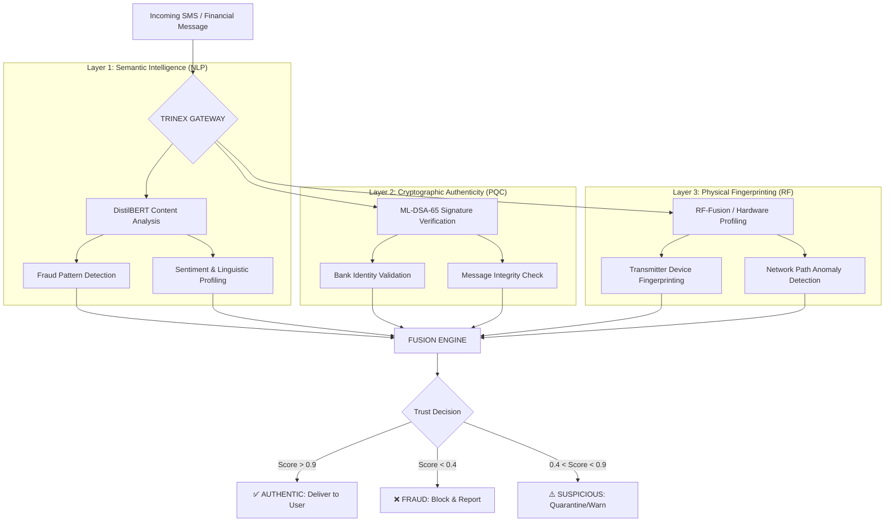

# TRINEX: Trilayer Communication Security System
## Proposed System Architecture

The **TRINEX** (Tri-layer Network Excellence) architecture is a multi-dimensional security framework designed to protect financial communications from advanced spoofing, phishing, and quantum-era cryptographic attacks. It operates on three distinct domains of validation: **Semantic**, **Cryptographic**, and **Physical**.

---

### 1. High-Level Architectural Flow

The system processes incoming financial messages through a sequential and parallel validation pipeline, aggregating results into a final **Trust Score**.

---

### 2. Deep Dive: The Three Layers

#### **Layer 1: Semantic & Behavioral Intelligence (NLP)**
*   **Purpose**: Analyzes the "What" — the content of the message.
*   **Mechanism**: Uses a fine-tuned **DistilBERT** model to identify semantic indicators of phishing (e.g., sense of urgency, suspicious links, grammatical anomalies).

#### **Layer 2: Post-Quantum Cryptography (PQC)**
*   **Purpose**: Validates the "Who" — the identity of the sender.
*   **Mechanism**: Implements **ML-DSA-65 (Dilithium3)** for digital signatures and **ML-KEM-768 (Kyber)** for key encapsulation.

#### **Layer 3: Physical Layer Security (RF Fingerprinting)**
*   **Purpose**: Validates the "Where" — the physical origin of the signal.
*   **Mechanism**: Uses **Radio Frequency (RF) Fingerprinting** to identify the unique hardware characteristics of the transmitting device.

---

### 3. The Fusion Engine: Multi-Factor Trust

The **Trust Fusion Engine** aggregates the weighted scores from all three layers to make a final trust decision. This defense-in-depth approach ensures that even if one layer is compromised, the others can still flag a threat.

---
**TRINEX: Securing the future of financial integrity.**
